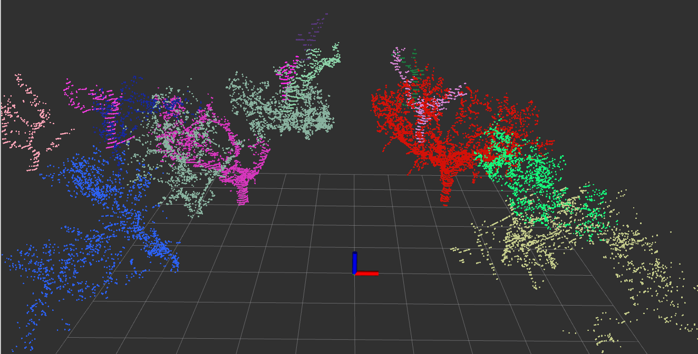
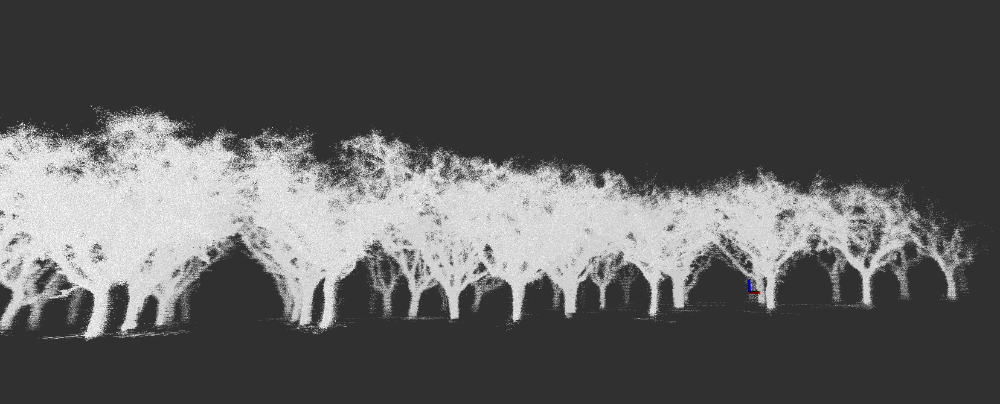

# Treescope LiDAR pipeline

A geometry-based LiDAR segmentation pipeline for fruit tree detection and tracking in orchard environments.

  
  <small>
  
 Fruit tree detection and tracking 

  </small>

  
  <small>
  
 Segmented fruit trees (one frame) 

  </small>

  
  <small>
  
 Accumulated pointcloud of segmented fruit trees 

  </small>

